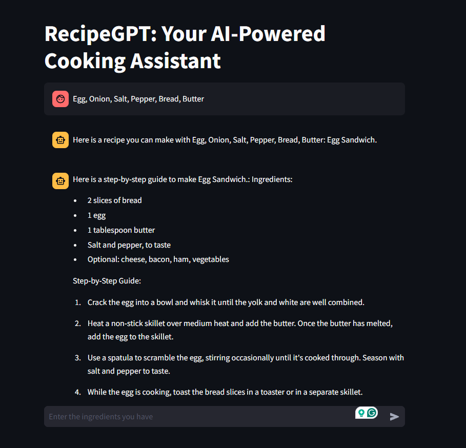

# RecipeGPT: Your AI-Powered Cooking Assistant
RecipeGPT is an AI-powered cooking assistant designed to help you make the most out of the ingredients you have. Just enter the ingredients you have, and RecipeGPT will suggest a recipe and provide a detailed step-by-step cooking guide.

## Features

- **Ingredient-Based Recipe Suggestions:** Input the ingredients you have, and RecipeGPT will suggest a suitable recipe.
- **Step-by-Step Cooking Guide:** Get a detailed cooking guide to make the recipe.
- **Powered by Azure OpenAI:** Utilizes Azure OpenAI for accurate and creative recipe suggestions.

## Installation

1. Clone the repository:
    ```bash
    [git clone https://github.com/yourusername/RecipeGPT-Your-AI-Powered-Cooking-Assistant.git]
    cd RecipeGPT-Your-AI-Powered-Cooking-Assistant
    ```

2. Install the required dependencies:
    ```bash
    pip install -r requirements.txt
    ```

3. Set up environment variables:
    ```bash
    export AZURE_OPENAI_API_KEY=your_azure_openai_api_key
    export AZURE_OPENAI_ENDPOINT=your_azure_openai_endpoint
    export OPENAI_API_VERSION=2023-03-15-preview
    ```

## Usage

1. Run the Streamlit application:
    ```bash
    streamlit run recipeGPT.py
    ```

2. Enter the ingredients you have in the chat input.

3. RecipeGPT will suggest a recipe and provide a step-by-step cooking guide.



## Contributing

Contributions are welcome! Please feel free to submit a Pull Request.

## License

This project is licensed under the MIT License.

